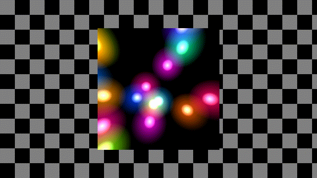
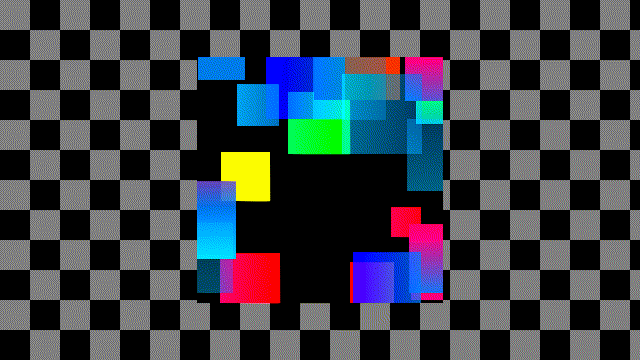
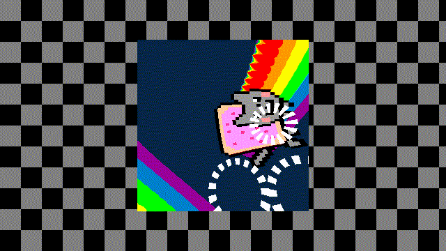
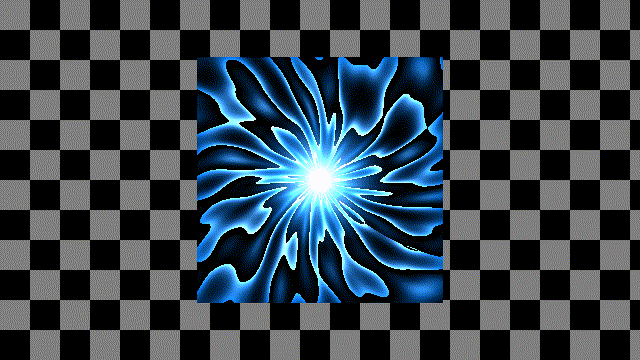
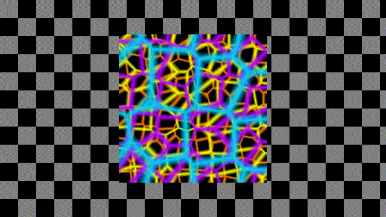
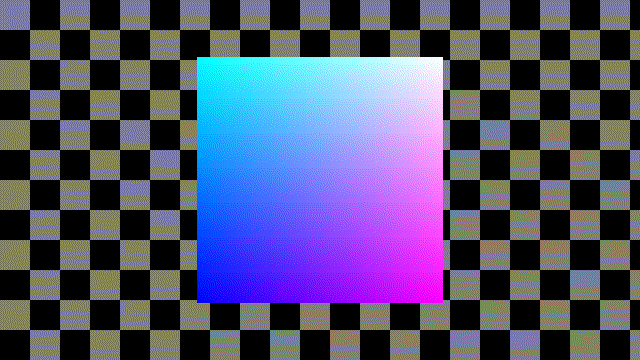
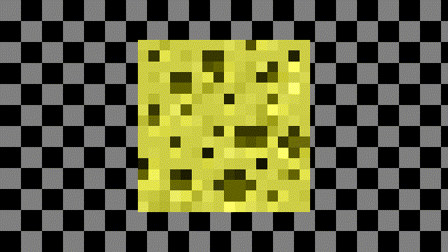
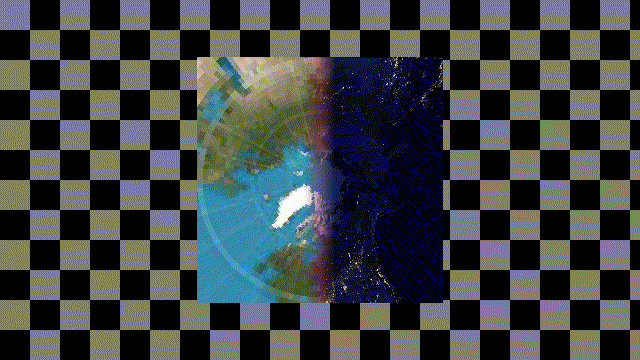

LED-Cube Shaders
================

This repository contains GLSL animations for my LED-Panel-Cube to be rendered
using [Shady](https://github.com/polyfloyd/shady).

## Usage
All animations for the cube should define a `mainCube` function as entry point
along with some boilerplate:
```glsl
void mainCube(out vec4 fragColor, in vec3 fragCoord) {
  // Animation code goes here...
}

#ifndef _EMULATOR
void mainImage(out vec4 fragColor, in vec2 fragCoord) {
  mainCube(fragColor, cube_map_to_3d(fragCoord));
}
#endif
```
The `mainImage` function renders for the actual cube. It is wrapped in an
`ifndef` so the emulator is allowed to redefine the `mainImage` function.

### Emulator
I've written a shader that acts as an emulator for the cube. It works by
defining a `mainImage` function that raymarches a cube and for each pixel on
the surface, calls `mainCube`.

Quick test:
```sh
shady -g 1366x768 -i emulator.glsl -i anim/globe.glsl -ofmt rgb24 -framerate 20 \
  | ffplay -loglevel quiet -f rawvideo -pixel_format rgb24 -video_size 1366x768 -framerate 20 -i -
```

## Rendered








